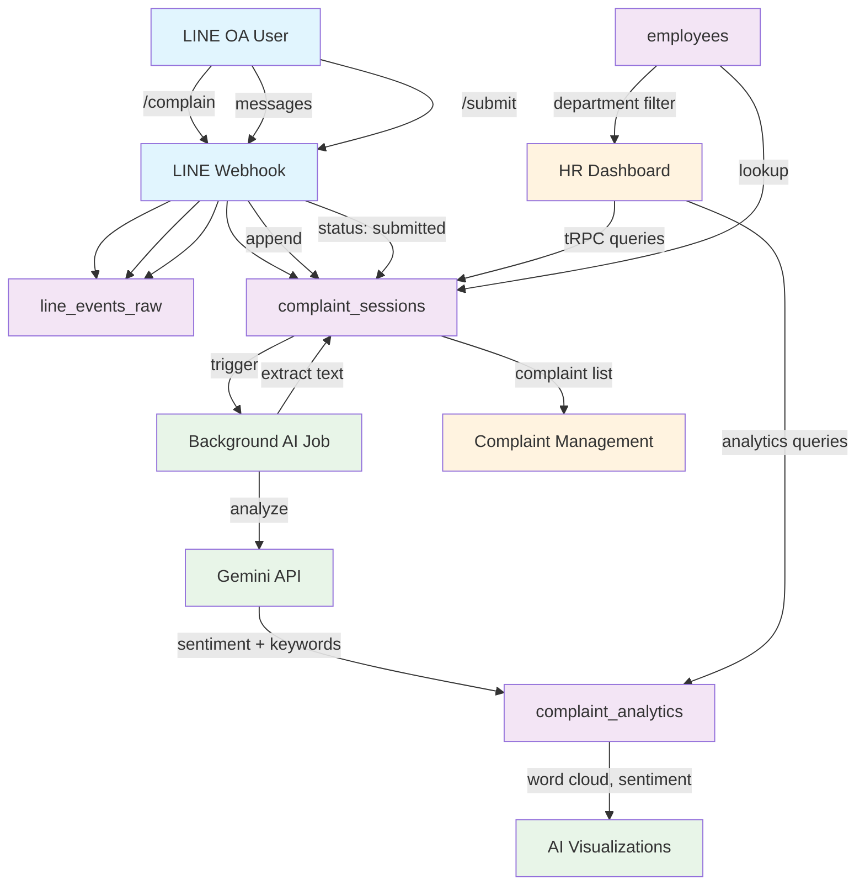

# Entity Relationship Diagram

## HR Complaint Management System with AI Analytics

This document provides the complete ER diagram for the complaint management system including AI analytics integration.

---

## ER Diagram (Mermaid)

```mermaid
erDiagram
    %% Core Entities
    EMPLOYEE {
        string user_id PK "LINE userId"
        string display_name
        string department "Optional"
        boolean active "Employee status"
        datetime created_at
        datetime updated_at
    }

    COMPLAINT_SESSION {
        string session_id PK "sess_YYYYMMDD_UUID"
        string complaint_id UK "CMP-YYYY-MM-DD-NNNN"
        string user_id FK "LINE userId"
        enum status "open, submitted"
        datetime start_time
        datetime end_time "nullable"
        string department "Denormalized from employee"
        array chat_logs "Embedded document array"
        datetime created_at
        datetime updated_at
    }

    CHAT_LOG {
        datetime timestamp
        enum direction "user, bot"
        enum message_type "text, image, file, command"
        string message "Content"
    }

    %% AI Analytics Entity
    COMPLAINT_ANALYTICS {
        string complaint_id PK FK "Links to complaint_session"
        string user_id FK "Denormalized for performance"
        enum sentiment "positive, negative, neutral"
        float confidence_score "0.0 - 1.0"
        array tags_keywords "Array of strings (3-5 items)"
        string ai_model_version "gemini-1.5-flash"
        datetime created_at "Analysis timestamp"
    }

    %% Audit Entity
    LINE_EVENTS_RAW {
        string event_id PK "evt_UUID"
        datetime received_at "TTL indexed (60 days)"
        string user_id "Extracted from payload"
        string event_type "LINE webhook event type"
        object payload "Raw LINE webhook JSON"
    }

    %% Relationships
    EMPLOYEE ||--o{ COMPLAINT_SESSION : "initiates"
    COMPLAINT_SESSION ||--o{ CHAT_LOG : "contains (embedded)"
    COMPLAINT_SESSION ||--o| COMPLAINT_ANALYTICS : "analyzed_by_ai"
    EMPLOYEE ||--o{ COMPLAINT_ANALYTICS : "analyzed_complaints"
    EMPLOYEE ||--o{ LINE_EVENTS_RAW : "generates_events"

    %% Indexes (shown as annotations)
    COMPLAINT_SESSION ||--|| IDX_STATUS_TIME : "{ status: 1, start_time: -1 }"
    COMPLAINT_SESSION ||--|| IDX_USER_TIME : "{ user_id: 1, start_time: -1 }"
    COMPLAINT_SESSION ||--|| IDX_COMPLAINT_ID : "{ complaint_id: 1 } unique"

    COMPLAINT_ANALYTICS ||--|| IDX_SENTIMENT_TIME : "{ sentiment: 1, created_at: -1 }"
    COMPLAINT_ANALYTICS ||--|| IDX_KEYWORDS : "{ tags_keywords: 1 }"

    LINE_EVENTS_RAW ||--|| IDX_TTL : "{ received_at: 1 } TTL 60 days"
```

---

## Entity Details

### Core Data Entities

#### 1. EMPLOYEE
- **Primary Key**: `user_id` (LINE userId)
- **Purpose**: Map LINE users to employee information
- **Cardinality**: 1:N with COMPLAINT_SESSION
- **Special Notes**:
  - Uses LINE userId as natural primary key
  - Department field is optional but useful for analytics
  - Active status allows soft deletion

#### 2. COMPLAINT_SESSION
- **Primary Key**: `session_id` (custom format)
- **Unique Key**: `complaint_id` (human-friendly)
- **Purpose**: Store complete complaint conversations
- **Cardinality**: 1:N with CHAT_LOG (embedded), 1:1 with COMPLAINT_ANALYTICS
- **Special Notes**:
  - Embeds chat_logs array for performance
  - Denormalizes department for fast filtering
  - Status controls workflow (open → submitted)

#### 3. CHAT_LOG (Embedded)
- **Parent**: COMPLAINT_SESSION
- **Purpose**: Individual messages in conversation
- **Structure**: Embedded array for atomic read/write operations
- **Special Notes**:
  - No separate _id (embedded document)
  - Direction indicates user vs bot messages
  - Message_type supports different media types

### AI Analytics Entities

#### 4. COMPLAINT_ANALYTICS
- **Primary Key**: `complaint_id` (links to session)
- **Purpose**: Store AI-generated insights
- **Cardinality**: 1:1 with COMPLAINT_SESSION
- **AI Source**: Google Gemini 1.5 Flash
- **Special Notes**:
  - Generated after complaint submission
  - Denormalizes user_id for independent queries
  - Tags_keywords array enables word cloud functionality

### Audit Entities

#### 5. LINE_EVENTS_RAW
- **Primary Key**: `event_id`
- **Purpose**: Debug and audit raw LINE webhook events
- **Cardinality**: N:1 with EMPLOYEE
- **Retention**: 60 days (TTL index)
- **Special Notes**:
  - Complete webhook payload preserved
  - Automatic cleanup via MongoDB TTL
  - Used for debugging LINE integration issues

---

## Data Flow Diagram



---

## Relationship Cardinalities

### Primary Relationships

| From Entity | To Entity | Cardinality | Relationship Type |
|-------------|-----------|-------------|------------------|
| EMPLOYEE | COMPLAINT_SESSION | 1:N | One employee can have many complaints |
| COMPLAINT_SESSION | CHAT_LOG | 1:N | One session contains many messages (embedded) |
| COMPLAINT_SESSION | COMPLAINT_ANALYTICS | 1:1 | Each complaint has one AI analysis |
| EMPLOYEE | COMPLAINT_ANALYTICS | 1:N | One employee's complaints analyzed (via session) |
| EMPLOYEE | LINE_EVENTS_RAW | 1:N | One employee generates many LINE events |

### Lookup Relationships

| From Entity | To Entity | Lookup Field | Purpose |
|-------------|-----------|-------------|---------|
| COMPLAINT_SESSION | EMPLOYEE | user_id | Get employee details |
| COMPLAINT_ANALYTICS | COMPLAINT_SESSION | complaint_id | Link analysis to original complaint |
| HR_DASHBOARD_QUERY | COMPLAINT_ANALYTICS | sentiment, tags_keywords | Generate analytics visualizations |

---

## Index Strategy

### Performance-Critical Indexes

#### complaint_sessions
```javascript
// Dashboard listing (most frequent query)
{ status: 1, start_time: -1 }

// User's complaint history
{ user_id: 1, start_time: -1 }

// Direct complaint lookup
{ complaint_id: 1 } // unique constraint

// Department filtering
{ department: 1, start_time: -1 }
```

#### complaint_analytics
```javascript
// Sentiment distribution
{ sentiment: 1, created_at: -1 }

// Keyword frequency (word cloud)
{ tags_keywords: 1 }

// Link to original complaint
{ complaint_id: 1 } // unique constraint

// User analytics
{ user_id: 1, created_at: -1 }
```

#### line_events_raw
```javascript
// TTL cleanup (MongoDB managed)
{ received_at: 1 } // expireAfterSeconds: 5184000 (60 days)
```

---

## Data Integrity Constraints

### Referential Integrity

#### Enforced by Application Logic:
- `complaint_sessions.user_id` → `employees._id`
- `complaint_analytics.complaint_id` → `complaint_sessions.complaint_id`
- `complaint_analytics.user_id` → `employees._id`
- `line_events_raw.user_id` → `employees._id`

#### Unique Constraints:
- `complaint_sessions.complaint_id` (business key)
- `complaint_analytics.complaint_id` (one analysis per complaint)
- `employees._id` (LINE userId)

### Business Rules

1. **Complaint Lifecycle**:
   - Sessions start with `status: "open"`
   - Only "open" sessions can receive new messages
   - Once "submitted", sessions are immutable
   - AI analysis only runs on "submitted" complaints

2. **Chat Log Rules**:
   - Must have at least one chat_log entry
   - First entry should be `/complain` command
   - Last entry for submitted complaints should be `/submit`

3. **AI Analytics Rules**:
   - Only created for submitted complaints
   - Confidence score must be between 0.0 and 1.0
   - Tags_keywords array must have 1-10 elements

---

## Query Patterns & Aggregations

### Dashboard Analytics Queries

#### Sentiment Distribution
```javascript
db.complaint_analytics.aggregate([
  { $group: {
      _id: "$sentiment",
      count: { $sum: 1 }
  }},
  { $sort: { count: -1 } }
])
```

#### Word Cloud Data
```javascript
db.complaint_analytics.aggregate([
  { $unwind: "$tags_keywords" },
  { $group: {
      _id: "$tags_keywords",
      frequency: { $sum: 1 }
  }},
  { $sort: { frequency: -1 } },
  { $limit: 50 }
])
```

#### Monthly Complaint Trends
```javascript
db.complaint_sessions.aggregate([
  { $match: { status: "submitted" } },
  { $group: {
      _id: {
        year: { $year: "$start_time" },
        month: { $month: "$start_time" }
      },
      count: { $sum: 1 }
  }},
  { $sort: { "_id.year": 1, "_id.month": 1 } }
])
```

#### Complaints with AI Analysis
```javascript
db.complaint_sessions.aggregate([
  { $match: { status: "submitted" } },
  { $lookup: {
      from: "complaint_analytics",
      localField: "complaint_id",
      foreignField: "complaint_id",
      as: "ai_analysis"
  }},
  { $unwind: { path: "$ai_analysis", preserveNullAndEmptyArrays: true } },
  { $sort: { start_time: -1 } }
])
```

---

## Scaling Considerations

### Current Design (0-1K employees)
- Single MongoDB instance
- Embedded chat logs for performance
- Real-time AI processing

### Medium Scale (1K-10K employees)
- MongoDB replica set
- Consider separate chat_logs collection if sessions grow large
- Queue-based AI processing

### Large Scale (10K+ employees)
- MongoDB sharding by user_id or date
- Separate read replicas for analytics
- Batch AI processing
- Data archiving strategy

---

## Migration & Evolution

### Schema Versioning
- Use `schema_version` field in documents
- Implement gradual migration scripts
- Maintain backward compatibility

### Future Enhancements
- Additional AI models (GPT, Claude)
- Sentiment scoring (not just classification)
- Topic modeling beyond simple keywords
- Multi-language support
- File attachment analysis

### Data Archival
- Move old complaints to separate collections
- Compress historical data
- Maintain indexes on active data only